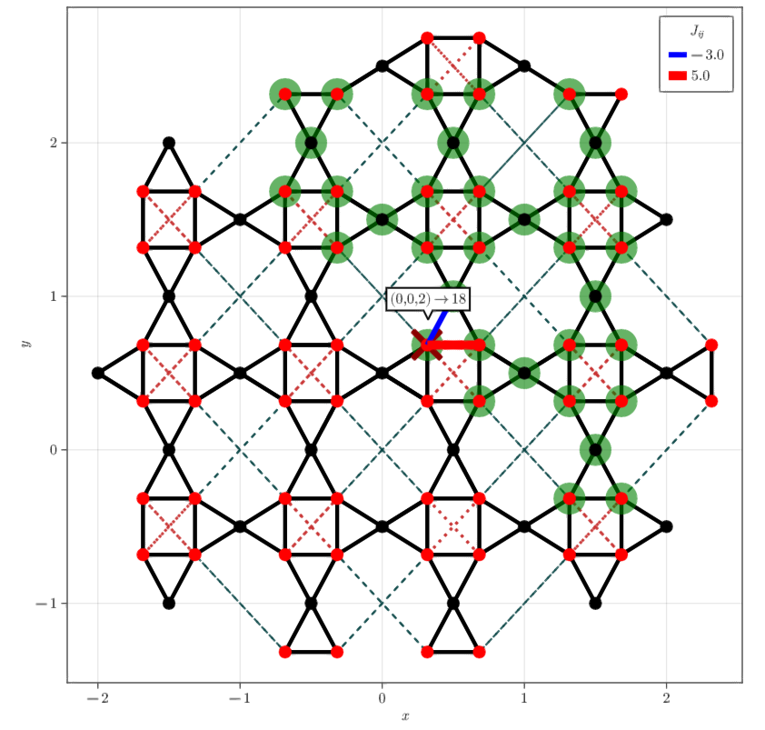

# FRGLatticePlotting.jl: visualize lattices in 2D and 3D
## Description
`FRGLatticePlotting.jl` is a package that provides functions to visualize lattices in 2D and 3D, based on `Makie.jl`. One particular aspect is the inspection of implementation details of lattices created via `SpinFRGLattices.jl`. 
## Features:
* Displaying lattice sites
* Color code symmetry inequivalent sites
* Show nearest neighbor bonds (or other bonds)
* Display strength of correlations/interaction strengths on the lattice
* Highlight symmetry inequivalent pairs
* Interactive inspection of useful information about the lattice
## Usage
To install the package, install the FRG registry (see PMFRG.jl) and run

```julia
] add FRGLatticePlotting

using FRGLatticePlotting, SpinFRGLattices

S = Pyrochlore.getPyrochlore(3, [5.,-3,0,1])
fig = plotSystem(S,Pyrochlore.Basis)
```


Here, sites that form symmetry inequivalent pairs with the reference site (cross) are highlighted in green. Hovering over a site displays the lattice coordinates `Rvec(n1,n2,n3,b)` and the corresponding Cartesian coordinates.

The standard settings use GLMakie for better interactive use, although one can also use CairoMakie for better export quality by running `FRGLatticePlotting.CairoMakie.activate!()` before plotting.
A slightly more involved example on how a plot can be customized is given below:
    
```julia
using FRGLatticePlotting, SpinFRGLattices
S = SquareKagome.getMirrorSquareKagome(6, 5.,-3)
Basis = SquareKagome.ShurikenBasis() #chose any you want for visualization
fig = plotSystem(S,Basis,
    refSite = 2,
    inspect = true,
    inequivScale = 2.5,
    Bonds = [
        (minDist = Basis.NNdist,maxDist = Basis.NNdist,colorRGB = [0,0,0]),
        (minDist = dist(Rvec(0,0,2),Rvec(0,0,4),Basis),maxDist = dist(Rvec(0,0,2),Rvec(0,0,4),Basis),colorRGB = [200,50,50]),
        (minDist = dist(Rvec(0,0,2),Rvec(-1,1,4),Basis),maxDist = dist(Rvec(0,0,2),Rvec(-1,1,4),Basis),colorRGB = [10,70,70])
    ],
    bondlw = [4,3,2],
    bondstyle = [:solid,:dot,:dash]
)
```


Hovering over an inequivalent pair displays the `pairNumber`, i.e. the position of the element in `S.PairList` 